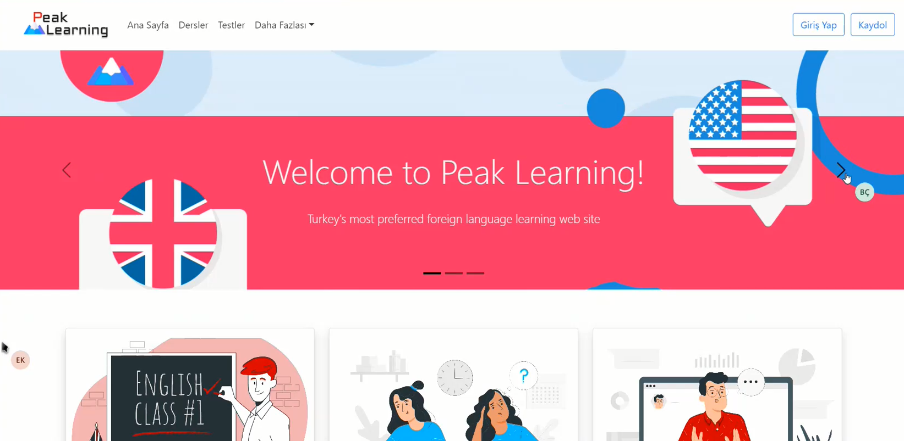
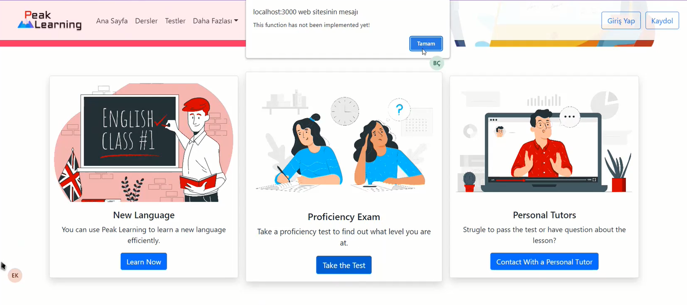
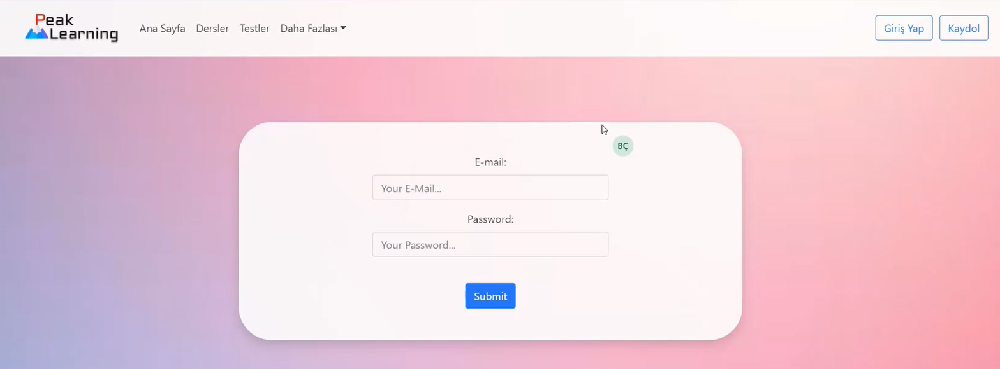
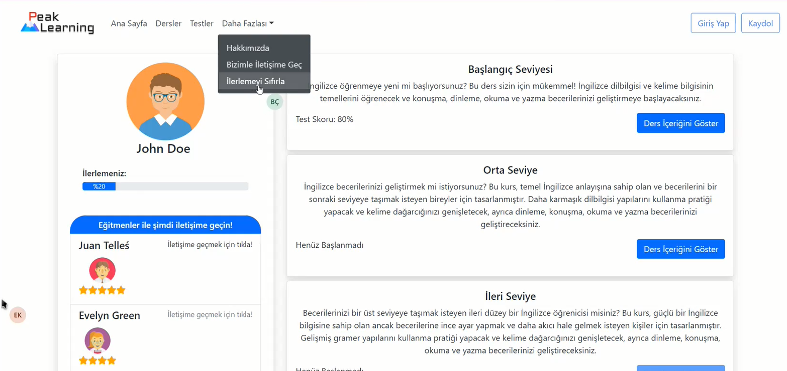
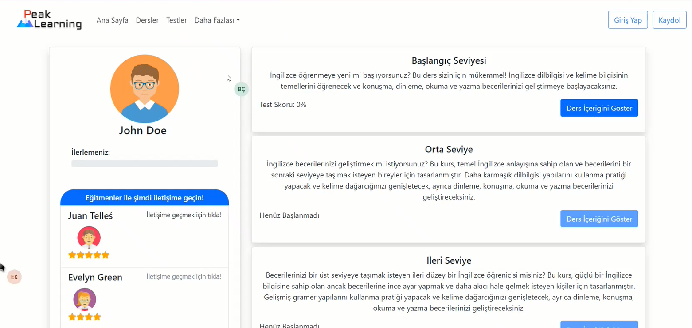
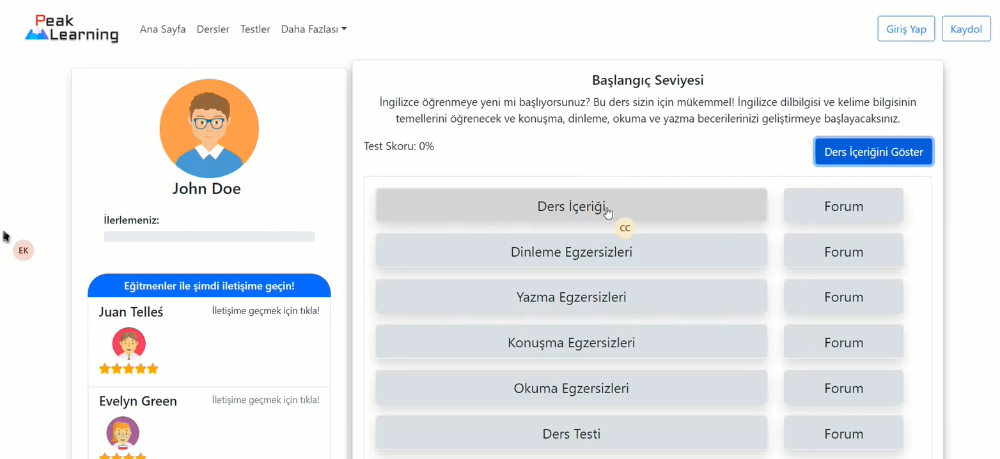

# LanguageLearningApp
This project is a collaborative group project aiming to develop a foreign language learning application. The application will be built using Java Spring on the Back-End, React.js on the Front-End, and MySQL on the database side.

## How to run?
To start the application, follow these steps:

1. Clone the project to your local machine.
2. Open the "Back-End" project in an IDE of your choice (IntelliJ IDEA and Java 11 were used in this project).
3. Use MySQL Workbench to import the data from the "Database" folder in the project.
4. Open the "Front-End" project in a development environment of your choice (Visual Studio Code was used in this project).
5. Install `node_modules` for the front-end by running `npm install` command.
6. Launch the "Front-End" project by running the command `npm start`.
7. After completing these steps, you can navigate through the application as desired.

## Overview
When the project is first initiated, you encounter the following screen:

Since the project is a demo project, not all functions have been implemented. Therefore, if a button other than the "Learn Now" button is clicked in any of the three sections at the bottom of the page, a warning message will be displayed.

After clicking the "Learn Now" button, a login screen has been designed, and an attempt has been made to simulate the login process.

After simulating the login process, the user will be directed to the "Lessons" page and will be presented with the following screen. On this page, sections have been simulated where user input is taken and available teachers are displayed, and the data in those sections is static.

Additionally, the user's progress so far is tracked using a progress bar. The progress bar increases as the user completes lessons of different levels, as shown in the image. Furthermore, as seen in the picture, clicking on the "Reset Progress" (İlerlemeyi Sıfırla) option allows the user to reset all progress.

After resetting the progress, as seen in the image, only the "Beginner Level" (Başlangıç Seviyesi) will be accessible. This is because during the development of the code, progression to the next level was blocked unless the score of the test taken after the training was 80% or higher. (When you look at the "Test Score" section, you can see your percentage.)

To begin the lessons, the user needs to click on the "Show Lesson Content" (Ders İçeriğini Göster) button. Once clicked, the lesson content will be displayed. However, apart from the lesson content and the option to take the lesson test, no other functionalities have been implemented. The user can either access the beginner level training by clicking on the lesson content or directly attempt the test without viewing the content.

After clicking on the lesson content, the user will be presented with the following screen. On this page, training content has been prepared for the beginner level. The content has been written both dynamically from the database and statically.

After completing the training or transitioning to the test section before completing the training, random questions will be retrieved from the database, with 15 questions being presented each time. To provide some assistance, Turkish explanations have been added to some of the questions. When a question is answered correctly, the chosen option will be displayed in green, and the counter on the left side, which keeps track of the number of correct answers, will be incremented by 1. Also incorrectly answered questions will display the options in red.

After completing the test, the user can see their test score and progress on the "Lessons" page once again.

